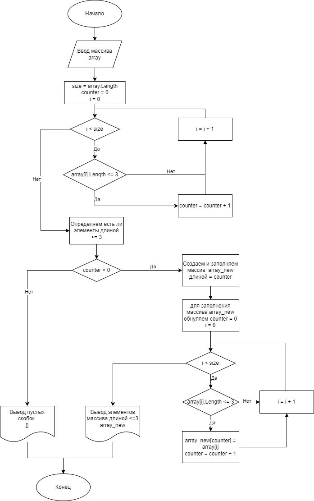

# Итоговая работа
## Постановка задачи: 
> Написать пргограмму, которая из имеющегося массива строк формирует массив из строк, длина которых меньше либо равна 3 символа. Первоначальный массив можно ввести с клавиатуры, либо задать на старте выполнения алгоритма. При решении не рекомендуется пользоваться коллекциями, лучше обойтись исключительно массивами.

## Описание решения задачи: 
> Учитывая рекомендации, решении задачи будет основано на работе с массивами строк. Этапы работы алгоритма на верхнем уровне будут следующими:

1.  Создадим входной массива данных
2.  В цикле определим есть ли вообще элементы массива длиной меньше или равно 3. Если есть, определим их количество и создадим новый массив этой длины.
3.  В следующем цикле скопируем каждый элемент массива длиной меньше или равной 3 в новый массив.
4. Выводим новый массив на печать

## Диаграмма решения задачи
Ниже изображен более детальный алгоритм решения задачи.

